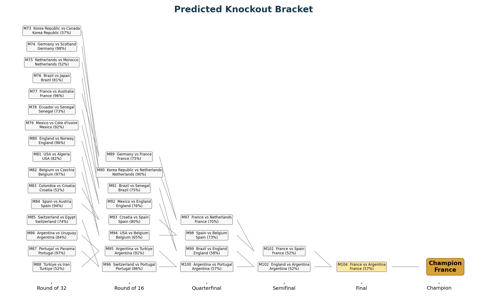
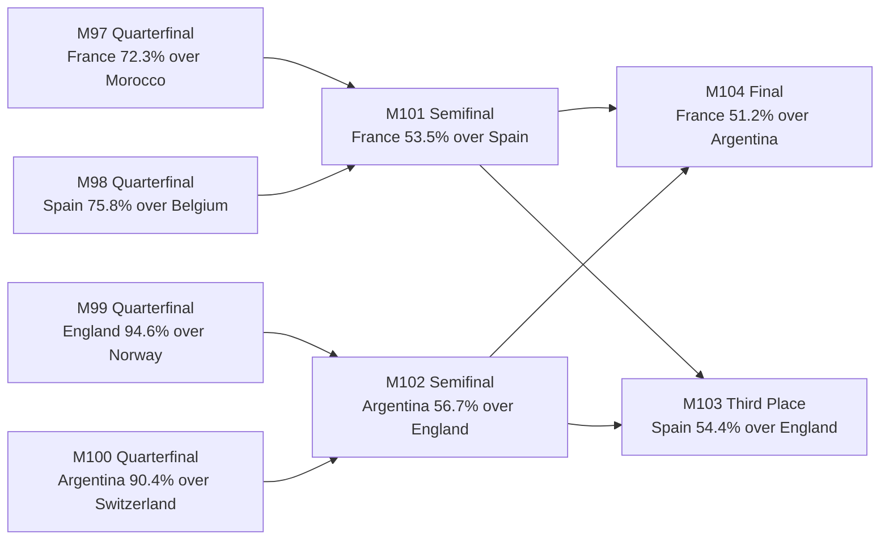

<div align="center">

# World Cup 2026 Prediction Lab

An evolving, auditable tournament forecast that blends results, player form,
human tactical reads, market priors, ticket planning, and bracket visualization.

[](worldcup_2026_prediction_bracket.ipynb)
[](worldcup_2026_interactive_bracket.html)
[](worldcup_2026_updated_tables_20260707.xlsx)
[](worldcup_2026_prediction_bracket_deck.pptx)

If GitHub Pages is enabled from the repo root, open the app at:

**https://zyy7390.github.io/worldcup26/**

</div>

## Current Snapshot

Last model refresh: **July 7, 2026, about 7:13 p.m. ET**

| Result | Team |
|---|---|
| Champion | France |
| Runner-up | Argentina |
| Third place | Spain |
| Fourth place | England |



## Explore The Work

| Artifact | What it is for |
|---|---|
| [Prediction notebook](worldcup_2026_prediction_bracket.ipynb) | Full analysis, formulas, model assumptions, plots, and executed results. |
| [Interactive bracket](worldcup_2026_interactive_bracket.html) | Filterable bracket view with match details, recommendations, ratings, and market diagnostic views. |
| [Updated tables workbook](worldcup_2026_updated_tables_20260707.xlsx) | Shareable Excel workbook with live bracket, market-integrated bracket, recommendations, and summary. |
| [Projected knockout CSV](worldcup_2026_projected_knockout_schedule_20260707.csv) | Machine-readable latest live bracket. |
| [Recommendations CSV](worldcup_2026_match_recommendations_20260707.csv) | Ticket-focused match shortlist with matchup, price, date, weekday, and weather factors. |
| [Presentation deck](worldcup_2026_prediction_bracket_deck.pptx) | A concise visual slide deck for sharing the bracket and story. |

## Projected Last Eight

| Round | Match | Date | Weekday | Matchup | Pick |
|---|---:|---|---|---|---|
| Quarterfinal | 97 | 2026-07-09 | Thursday | France vs Morocco | France, 72.3% |
| Quarterfinal | 98 | 2026-07-10 | Friday | Spain vs Belgium | Spain, 75.8% |
| Quarterfinal | 99 | 2026-07-11 | Saturday | Norway vs England | England, 94.6% |
| Quarterfinal | 100 | 2026-07-11 | Saturday | Argentina vs Switzerland | Argentina, 90.4% |
| Semifinal | 101 | 2026-07-14 | Tuesday | France vs Spain | France, 53.5% |
| Semifinal | 102 | 2026-07-15 | Wednesday | England vs Argentina | Argentina, 56.7% |
| Third-place Match | 103 | 2026-07-18 | Saturday | Spain vs England | Spain, 54.4% |
| Final | 104 | 2026-07-19 | Sunday | France vs Argentina | France, 51.2% |



## Games To Watch

The recommendation model prioritizes the user's team preferences first, then
price fit, then date and weather convenience.

| Rank | Match | Round | Weekday | Possible matchup | Score |
|---:|---:|---|---|---|---:|
| 1 | 100 | Quarterfinal | Saturday | Argentina vs Switzerland | 4.56 |
| 2 | 102 | Semifinal | Wednesday | England vs Argentina | 4.44 |
| 3 | 99 | Quarterfinal | Saturday | Norway vs England | 4.43 |
| 4 | 104 | Final | Sunday | France vs Argentina | 4.31 |
| 5 | 101 | Semifinal | Tuesday | France vs Spain | 4.16 |

<details>
<summary><strong>How the model works</strong></summary>

The live rating for each team is built from a transparent stack of signals:

```text
updated_rating =
  FIFA-rank base
+ host bonus
+ squad-depth modifier
+ live result shock
+ player-form signal
+ human tactical prior
+ prediction-market prior
```

The notebook separates these layers so each update can be reviewed. Human reads
are deliberately explicit rather than hidden inside a vague "form" number.
Prediction market data is blended lightly with `market_weight = 0.10`, so it can
correct the model without taking over the forecast.

</details>

<details>
<summary><strong>Latest human analytics incorporated</strong></summary>

- France were upgraded after Paraguay for title-level tenacity and attacking talent.
- Argentina kept a high resilience score, but received a penalty for Messi overreliance and reduced supporting-player dynamism.
- England were upgraded for collaboration, attacking talent, and 10-man defensive resilience against Mexico.
- Spain stayed structurally strong, but received a finishing and chance-creation caution.
- Switzerland were upgraded defensively after Colombia, while open-play attack remains the concern.
- Norway were upgraded for the Haaland, Odegaard, and Nusa transition path after beating Brazil.

</details>

<details>
<summary><strong>Data sources and caveats</strong></summary>

Core inputs include:

- Official-style match schedule and bracket structure.
- Latest locked match results through Switzerland 0-0 Colombia, Switzerland 4-3 on penalties.
- Saved Google lineup player-rating extracts from the July 2 sweep.
- Event and player-performance proxies where rendered ratings were unavailable.
- Polymarket July 7 outright market snapshot.
- Kalshi public-market snapshots kept as diagnostics when markets were not clean single-team or W-D-L priors.

Important caveat: the July 7 Google player-rating scrape hit Google's
"sorry/unusual traffic" page, so new Round of 16 player-rating cards were not
scraped in that run. The notebook preserves the existing 2,334 saved Google
player-rating rows and uses result proxies plus human reads for the latest R16
matches.

</details>

<details>
<summary><strong>Reproduce the latest notebook run</strong></summary>

The project has been run with the Windows Anaconda Python environment:

```powershell
C:\Users\19980\anaconda3\python.exe
```

From PowerShell:

```powershell
cd D:\worldcup26

& 'C:\Users\19980\anaconda3\python.exe' update_worldcup26_notebook_live.py

$env:USERPROFILE='D:\worldcup26\.home'
$env:HOME='D:\worldcup26\.home'
$env:JUPYTER_CONFIG_DIR='D:\worldcup26\.jupyter-config'
$env:JUPYTER_DATA_DIR='D:\worldcup26\.jupyter-data'
$env:JUPYTER_RUNTIME_DIR='D:\worldcup26\.jupyter-runtime'
$env:IPYTHONDIR='D:\worldcup26\.ipython'
$env:WORLDCUP26_SKIP_WIDGETS='1'

& 'C:\Users\19980\anaconda3\python.exe' -m jupyter nbconvert `
  --to notebook --execute --inplace worldcup_2026_prediction_bracket.ipynb `
  --ExecutePreprocessor.timeout=900

& 'C:\Users\19980\anaconda3\python.exe' make_worldcup26_interactive_html.py
```

</details>

<details>
<summary><strong>Git update workflow</strong></summary>

Use one commit per tournament update so model accuracy can be audited later:

```powershell
cd D:\worldcup26
git status
git add .
git commit -m "Update model after latest World Cup matches"
git push
```

For comparison over time:

```powershell
git log --oneline
git diff HEAD~1 -- worldcup_2026_projected_knockout_schedule_20260707.csv
```

</details>

## Why This Exists

The goal is not to pretend a model can remove uncertainty from football. The
goal is to make every belief visible: what came from the data, what came from
market prices, what came from match watching, and how those beliefs changed as
the tournament unfolded.

