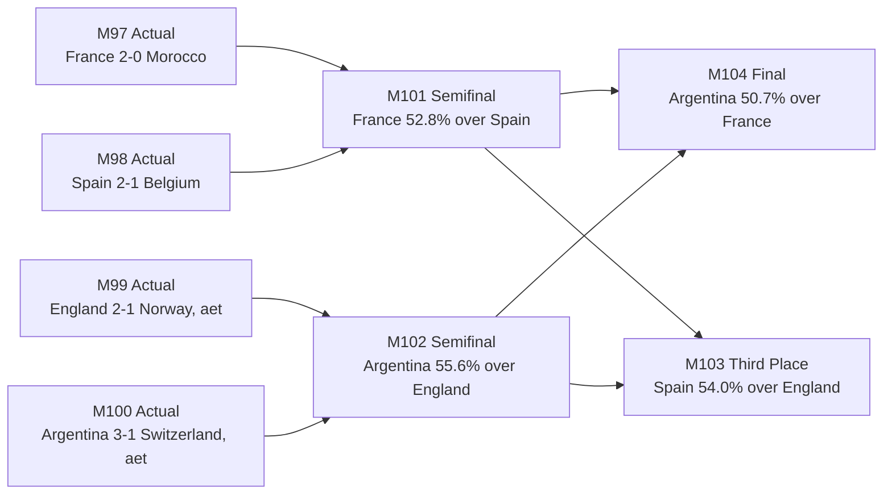

<div align="center">

# World Cup 2026 Prediction Lab

An evolving, auditable tournament forecast that blends results, player form,
human tactical reads, market priors, ticket planning, and bracket visualization.

[](notebooks/worldcup_2026_prediction_bracket.ipynb)
[](outputs/worldcup_2026_interactive_bracket.html)
[](outputs/tables/worldcup_2026_updated_tables_20260712.xlsx)
[](docs/data_quality_investigation.md)
[](outputs/presentations/worldcup_2026_prediction_bracket_deck.pptx)

If GitHub Pages is enabled from the repo root, open the app at:

**https://zyy7390.github.io/worldcup26/**

</div>

## Current Snapshot

Last model refresh: **July 12, 2026, about 3:20 p.m. ET**

| Result | Team |
|---|---|
| Champion | Argentina |
| Runner-up | France |
| Third place | Spain |
| Fourth place | England |


## Explore The Work

| Artifact | What it is for |
|---|---|
| [Prediction notebook](notebooks/worldcup_2026_prediction_bracket.ipynb) | Full analysis, formulas, model assumptions, plots, and executed results. |
| [Interactive bracket](outputs/worldcup_2026_interactive_bracket.html) | Filterable bracket view with match details, country highlighting, zoom controls, recommendations, ratings, and market diagnostic views. |
| [Updated tables workbook](outputs/tables/worldcup_2026_updated_tables_20260712.xlsx) | Shareable Excel workbook with live bracket, market-integrated bracket, recommendations, market snapshot, and source coverage. |
| [Projected knockout CSV](outputs/tables/worldcup_2026_projected_knockout_schedule_20260712.csv) | Machine-readable latest live bracket. |
| [Recommendations CSV](outputs/tables/worldcup_2026_match_recommendations_20260712.csv) | Ticket-focused shortlist for the four remaining matches. |
| [Presentation deck](outputs/presentations/worldcup_2026_prediction_bracket_deck.pptx) | A concise visual slide deck for sharing the bracket and story. |
| [Data quality investigation](docs/data_quality_investigation.md) | Current coverage, pipeline diagnostics, missingness causes, and notebook integration status. |
| [Notebook archive](notebooks/archive/worldcup_2026_prediction_bracket.pre_live_update_20260617.ipynb) | Sanitized pre-live-update notebook snapshot available in the current project files. |

## Last Eight: Actuals + Forecast

| Round | Match | Date | Weekday | Matchup | Pick |
|---|---:|---|---|---|---|
| Quarterfinal | 97 | 2026-07-09 | Thursday | France vs Morocco | Actual: France 2-0 |
| Quarterfinal | 98 | 2026-07-10 | Friday | Spain vs Belgium | Actual: Spain 2-1 |
| Quarterfinal | 99 | 2026-07-11 | Saturday | Norway vs England | Actual: England 2-1 (aet) |
| Quarterfinal | 100 | 2026-07-11 | Saturday | Argentina vs Switzerland | Actual: Argentina 3-1 (aet) |
| Semifinal | 101 | 2026-07-14 | Tuesday | France vs Spain | France, 52.8% |
| Semifinal | 102 | 2026-07-15 | Wednesday | England vs Argentina | Argentina, 55.6% |
| Third-place Match | 103 | 2026-07-18 | Saturday | Spain vs England | Spain, 54.0% |
| Final | 104 | 2026-07-19 | Sunday | France vs Argentina | Argentina, 50.7% |



## Player Value vs Performance

The notebook compares World Cup post-match ratings against Transfermarkt market
value. The chart below uses direct SofaScore ratings with minutes weighting and
highlights star players from the four semifinalists.


The interactive bracket app also includes this value/performance chart as a
clickable SVG: select a country to highlight it across the bracket and chart,
click a player dot to focus that country, and use zoom controls for closer
inspection.

## Games To Watch

The recommendation model prioritizes the user's team preferences first, then
price fit, then date and weather convenience.

| Rank | Match | Round | Weekday | Possible matchup | Score |
|---:|---:|---|---|---|---:|
| 1 | 102 | Semifinal | Wednesday | England vs Argentina | 4.44 |
| 2 | 104 | Final | Sunday | France vs Argentina | 4.31 |
| 3 | 101 | Semifinal | Tuesday | France vs Spain | 4.16 |
| 4 | 103 | Third-place Match | Saturday | Spain vs England | 3.75 |

<details>
<summary><strong>How the model works</strong></summary>

The live rating for each team is built from a transparent stack of signals:

```text
updated_rating =
  FIFA-rank base
+ host bonus
+ squad-depth modifier
+ live result shock
+ player-form signal
+ human tactical prior
+ prediction-market prior
```

The notebook separates these layers so each update can be reviewed. Human reads
are deliberately explicit rather than hidden inside a vague "form" number.
Prediction market data is blended lightly with `market_weight = 0.10`, so it can
correct the model without taking over the forecast.

</details>

<details open>
<summary><strong>Human analytics ledger</strong></summary>

These are the historical analyst reads captured during the project and folded
into either player-form signals, team tactical deltas, or matchup-specific
priors.

| Theme | Human read | Model treatment |
|---|---|---|
| Korea vs Canada | Canada's Qatar win mattered, but Korea's lineup quality still deserved respect even with Son Heung-min aging. | Korea was treated as a narrow 50-60% style favorite in that matchup prior. |
| Morocco vs Japan | Morocco's AFCON/2022 pedigree was strong, but Japan's teamwork and results made them dangerous. | Morocco edge compressed to roughly 60-70%, not a blowout. |
| Portugal vs Croatia | Portugal had elite names but poor team play; Ronaldo's low mobility, offside-line positioning, and chance selection were major drags. | Croatia-leaning analyst prior and Portugal tactical penalty. |
| Morocco vs Norway | Morocco were clearly stronger overall, but Norway's Haaland counterattacking path could punish tiny chances. | Morocco favored around 70-80%; Norway upset path kept alive. |
| Mexico vs England | England's talent/pedigree were superior, but Mexico's collective running, passing, dribbling, and ball progression looked much better than the base model credited. | England remained favored, but Mexico's tactical upgrade compressed the gap before England advanced. |
| Portugal vs Spain | Spain's structure and control looked materially better than Portugal's chance creation. | Spain received a strong head-to-head prior over Portugal. |
| Argentina vs Belgium | Belgium looked diminished from its peak; Lukaku struggled as a starter, and draws against Egypt/Iran reduced confidence. | Argentina received a very strong matchup prior over Belgium. |
| Cristiano Ronaldo aging curve | Ronaldo's post-match rating understated the problem: weak chance conversion, limited facilitation, little pressing, and low back-and-forth impact. | Ronaldo signals were discounted and Portugal team-play was penalized. |
| Portugal vs Uzbekistan revision | Portugal showed better cohesion and Ronaldo participation against Uzbekistan, but 90 minutes for Ronaldo still looked suboptimal and glory-driven. | Portugal's team signal improved slightly, but Ronaldo/role concerns remained capped. |
| Harry Kane clutch signal | Kane showed comprehensive striker play and superstar late-match deciding power. | England's late-game ceiling and Kane player-form signal were upgraded. |
| Mexico collective quality | Mexico looked almost Argentina-like in team movement and progression despite lacking a single global superstar. | Mexico received a team-cohesion tactical upgrade. |
| Portugal post-Uzbekistan caution | Portugal still did not create enough repeatable chances; Ronaldo's brace looked more like opponent error/luck than proof of high-level current impact. | Portugal retained a negative tactical delta. |
| Belgium psychology | Belgium lacked title-winning ferocity; the Senegal win looked lucky/even, and Lukaku seemed better as a bench option. | Belgium's title profile was downgraded despite later USA conversion. |
| USA quality | USA looked tenacious, physical, technical, and coordinated, better than player market value implied. | USA received a collective-quality upgrade before elimination. |
| France vs Paraguay | France showed next-level tenacity and attacking talent even in a narrow knockout win. | France received a title-ceiling tactical upgrade. |
| Argentina vs Cape Verde/Egypt | Argentina showed tenacity, but Messi overreliance and lower supporting-player running/creativity were worrying. | Argentina kept resilience credit but received a Messi-dependence penalty. |
| England vs Mexico | England showed collaboration, attacking talent, and strong 10-man defensive resilience. | England tactical delta increased after the R16. |
| Spain latest form | Spain remained structurally good, but Lamine Yamal and midfield chance creation were muted; Oyarzabal was not a traditional No. 9 finisher. | Spain kept control credit but received a finishing/chance-creation caution. |
| Switzerland vs Colombia | Switzerland's defense looked excellent, but open-play offense remained limited. | Switzerland received defensive credit and attacking ceiling caution. |
| Norway vs Brazil | Norway could catch elite opponents off guard; if Odegaard/Nusa can find Haaland, the chances are extremely dangerous. | Norway received a transition-threat upgrade, offset by possession/build-up limitations. |
| Argentina vs Switzerland | Argentina's defense and Emiliano Martinez look less dominant than in 2022, and Messi appeared fatigued after repeated long matches. Lisandro Martinez's interventions, Almada's width, Jose Manuel Lopez's movement/link play, and the squad's tenacity supplied valuable alternatives. | Defense and Messi-workload penalties are balanced against a depth/tenacity upgrade; direct SofaScore ratings remain separate from this human layer. |

</details>

<details>
<summary><strong>Data sources and caveats</strong></summary>

Core inputs include:

- Official-style match schedule and bracket structure.
- Latest locked match results through Argentina 3-1 Switzerland after extra time in M100.
- Direct SofaScore lineup ratings, minutes, team stats, and shot maps for all 100 completed matches.
- Saved Google lineup player-rating extracts kept as a fallback/audit trail.
- Transparent event and human observations kept separate from direct ratings.
- July 12 Polymarket and Kalshi outright and final-qualifier snapshots.
- Complete Kalshi match-advance markets for France-Spain and England-Argentina.

The notebook and interactive site now share the same SofaScore CSVs. R32-and-later
player form is minutes-weighted and stage-weighted; Google is used only when a
match lacks SofaScore rows. Prediction markets remain a light `0.10` input.

</details>

<details>
<summary><strong>Repository layout</strong></summary>

```text
assets/
  ppt/       bracket and deck images
  readme/    README showcase images
data/
  google/    scraped and normalized lineup ratings
  markets/   Polymarket and Kalshi snapshots
  sofascore/ direct event mapping, ratings, stats, and shot maps
docs/        data-quality and methodology notes
notebooks/   executed analysis notebook
outputs/
  tables/    CSV/XLSX summaries
  presentations/
scripts/     generators, extractors, repair utilities
```

</details>

<details>
<summary><strong>Reproduce the latest notebook run</strong></summary>

Use the same Python environment that has `pandas`, `matplotlib`, `nbformat`, and
`jupyter` installed. From the repository root:

```powershell
python scripts/sofascore_worldcup_data_fetcher.py --fetch
python scripts/fetch_prediction_market_data.py --as-of 20260712
python scripts/update_worldcup26_notebook_live.py

$env:USERPROFILE = Join-Path (Get-Location) ".home"
$env:HOME = Join-Path (Get-Location) ".home"
$env:JUPYTER_CONFIG_DIR = Join-Path (Get-Location) ".jupyter-config"
$env:JUPYTER_DATA_DIR = Join-Path (Get-Location) ".jupyter-data"
$env:JUPYTER_RUNTIME_DIR = Join-Path (Get-Location) ".jupyter-runtime"
$env:IPYTHONDIR = Join-Path (Get-Location) ".ipython"
$env:WORLDCUP26_SKIP_WIDGETS = "1"

python -m jupyter nbconvert `
  --to notebook --execute --inplace notebooks/worldcup_2026_prediction_bracket.ipynb `
  --ExecutePreprocessor.timeout=900

python scripts/make_worldcup26_interactive_html.py
python scripts/make_readme_assets.py
python scripts/export_worldcup26_tables.py --as-of 20260712
python scripts/make_worldcup26_ppt.py
```

</details>

<details>
<summary><strong>Git update workflow</strong></summary>

Use one commit per tournament update so model accuracy can be audited later:

```powershell
git status
git add .
git commit -m "Update model after latest World Cup matches"
git push
```

For comparison over time:

```powershell
git log --oneline
git diff HEAD~1 -- outputs/tables/worldcup_2026_projected_knockout_schedule_20260712.csv
```

</details>

## Why This Exists

The goal is not to pretend a model can remove uncertainty from football. The
goal is to make every belief visible: what came from the data, what came from
market prices, what came from match watching, and how those beliefs changed as
the tournament unfolded.
